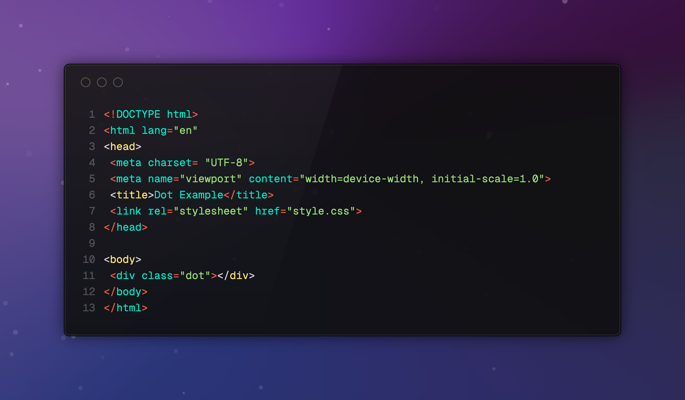
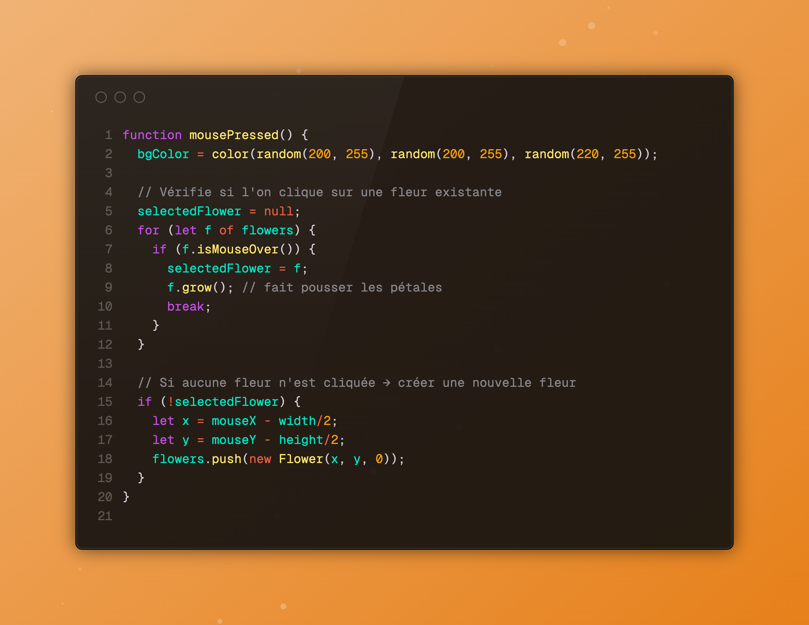
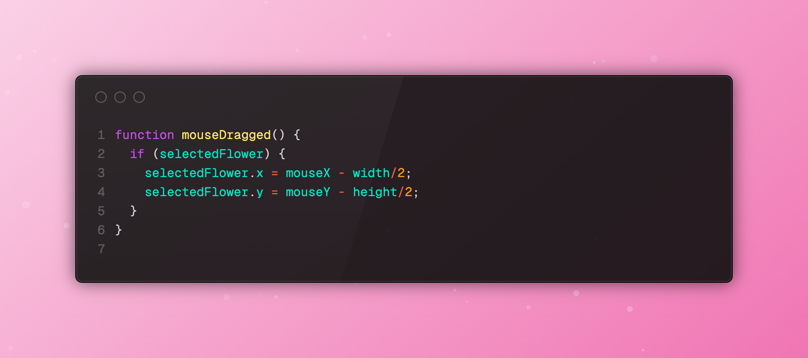
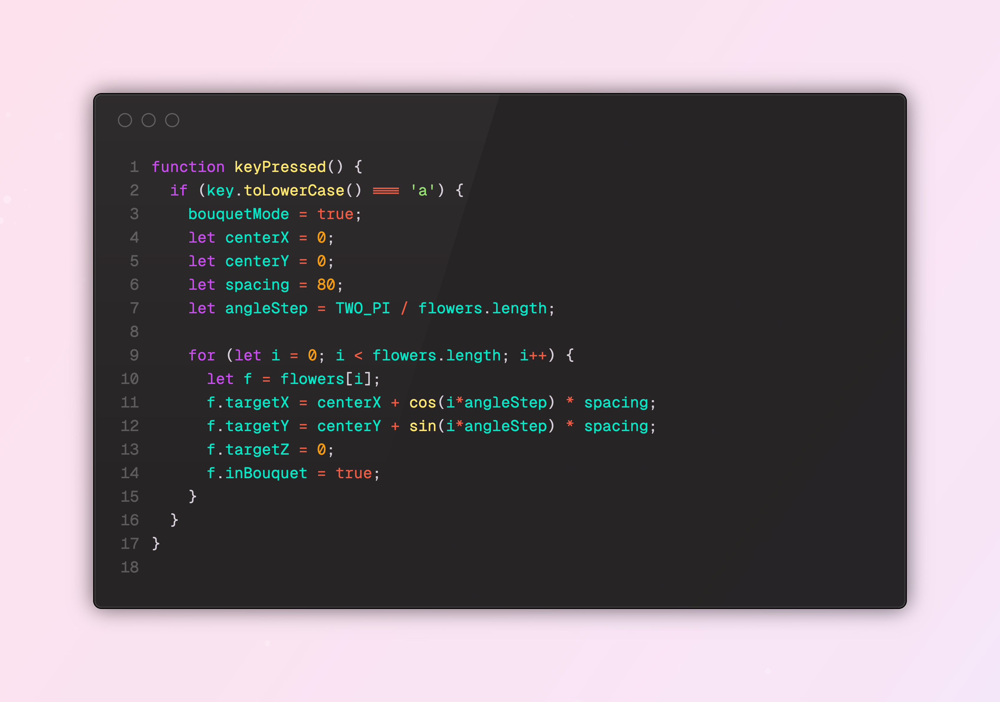
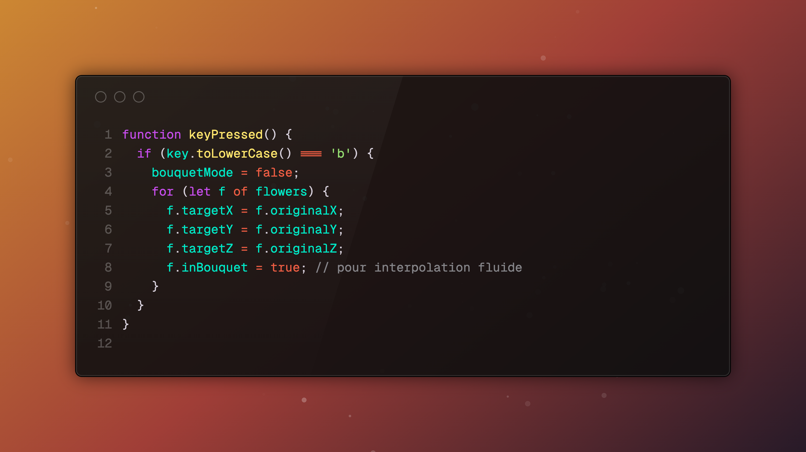

# Creative Coding: Web tool

## 1. Descriptif

### Objectif: Créer une page web interactive où l’utilisateur peut

. Faire apparaître un point en cliquant sur l’écran.

. En appuyant sur chaque point une fleur géométrique se forme

. Déplacer les fleurs pour créer un jardin personnalisé.

. Former un bouquet avec toutes les fleurs en appuyant sur une touche spécifique du clavier. (exemple touche A et toutes les fleurs se rassemblent)

.Retourner les fleurs à leur position initiale avec une autre touche.(exemple touche b et toutes les fleurs reprennent leur position initiale)

.Profiter d’une expérience visuelle agréable avec des animations 3D et des couleurs dynamiques (avec un background qui change de couleur à chaque click).

## 2. Idées & Références

- circle
- formes géométriques
- fleurs
- animation 3D
- [Reference 1](https://www.pinterest.com/pin/844493675926741/)
- [Reference 2](https://www.pinterest.com/pin/35114072089028173/)
  

## 3. Snippets

 [//]: <> (Dot Code.)

 ### a. Code HTML pour un point
 

### b. Code CSS pour un point

### c. Créer un point au click

### d. Créer une nouvelle fleur au click

### e. Déplacer une image avec la souris

### f. Former un bouquet avec toutes les fleurs (touche A)

### g. Retour des fleurs à leur position initiale

